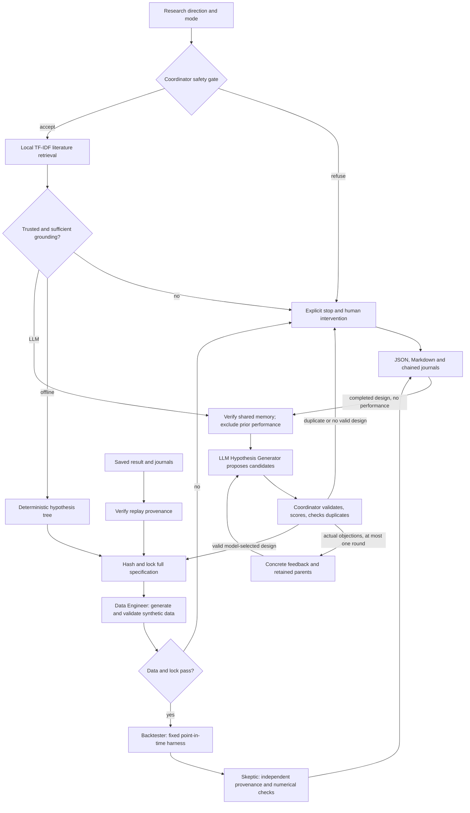

# Investment Signal Research Agent

**Deterministic synthetic data · Historical research only · Not investment advice · No trade execution · Not evidence of future performance · Not evidence about real markets**

A capstone research assistant for students and research engineers who need to turn a broad investment-signal question into an inspectable, falsifiable experiment. Five separate roles retrieve literature, design and lock a hypothesis, validate synthetic data, run a point-in-time backtest, and independently critique the result.

| Execution path | Research design | Credentials/network |
|---|---|---|
| **Offline MVP** (default) | Preserved deterministic candidate tree; 12-month lookback, four selected assets | None; standard-library runtime and tests |
| **LLM-assisted research MVP** | OpenAI-generated structured candidates, actual validation feedback, verified prior memory, supported design choices | Optional SDK and local `OPENAI_API_KEY`; explicitly selected |
| **Saved-specification replay** | Verify an original completed run and execute its unchanged lock | None; zero provider calls |

**Live verification remains incomplete.** This workspace has no configured `OPENAI_API_KEY`. Offline and mocked checks pass; the real-provider batch records zero actual provider calls. Mocked success is not a genuine LLM demonstration. See [the capstone handoff](docs/capstone_evidence.md) and [live status](artifacts/live_verification/live_verification_results.json).

## Architecture



| Role | Implemented responsibility |
|---|---|
| Coordinator | Owns routing, actions, deterministic assessments, feedback, budgets, duplicate decisions, locking, gates, and artifacts. |
| Hypothesis Generator | Offline: predefined bounded search. LLM: proposes claims, executable parameters, citations, assumptions, concise decisions, and optional revisions. |
| Data Engineer | Generates deterministic synthetic monthly prices and checks schema, histories, prices, calendar, availability, universe, and leakage. |
| Backtester | Executes accepted parameters unchanged with lagged signals, drift-aware turnover, costs, and equal-weight benchmark. |
| Skeptic | Independently checks mode contracts, lock, evidence, audit chronology, search, signals, weights, costs, observations, statistics, and interpretation. |

Only the Hypothesis Generator uses an LLM. No CrewAI, LangGraph, MCP integration, vector database, learned embeddings, real-market data, brokerage connection, generated-code execution, or additional LLM agents are implemented. See [architecture.md](docs/architecture.md) for contracts and formulas.

## Install and configure

Python 3.10 or newer is required. These are single-line PowerShell commands from the repository root:

```powershell
python -m venv .venv
.\.venv\Scripts\python.exe -m pip install .
.\.venv\Scripts\python.exe -m unittest discover -s tests -v
```

The base package and tests have no third-party dependencies. Pip may download setuptools during installation; offline execution needs no network. In an activated environment use `python`; on macOS/Linux use `.venv/bin/python`. For source-only use, set `$env:PYTHONPATH = "src"`. `requirements.txt` describes the empty base runtime dependency set.

For explicit LLM mode, install the optional SDK and enter the key locally with hidden input:

```powershell
.\.venv\Scripts\python.exe -m pip install ".[llm]"
$env:OPENAI_API_KEY = [System.Net.NetworkCredential]::new('', (Read-Host 'OpenAI API key' -AsSecureString)).Password
$env:OPENAI_MODEL = 'gpt-4.1-mini-2025-04-14'
```

Never put credentials in source, command arguments, prompts, journals, or chat. The key remains in the current PowerShell environment. The model setting is optional; the documented snapshot is the default, and `--model` can override it. Unsupported models fail explicitly. The optional SDK was installed and checked as version 2.54.0.

The adapter follows official [Structured Outputs](https://developers.openai.com/api/docs/guides/structured-outputs), [Python Responses](https://developers.openai.com/api/reference/python/resources/responses/methods/create), and [GPT-4.1 Mini](https://developers.openai.com/api/docs/models/gpt-4.1-mini) documentation. It uses lazy SDK import, `responses.create`, strict `text.format`, `store=False`, the fixed OpenAI endpoint, no tools, SDK retries disabled, and a 30-second SDK HTTP timeout. Context is capped at 24,000 characters; output at 16,000 characters and a default 2,500 output tokens. Unknown token usage and cost remain `null`. The HTTP timeout is not an operating-system execution deadline.

## Exact commands

Preserved offline behavior:

```powershell
.\.venv\Scripts\python.exe -m signal_research_agent run --topic "Explore whether lower-volatility stocks have better risk-adjusted returns" --output-dir artifacts/run
.\.venv\Scripts\python.exe -m signal_research_agent evaluate --output-dir artifacts/offline_evaluation
.\.venv\Scripts\python.exe -m signal_research_agent corpus
```

LLM design with persistent shared memory:

```powershell
.\.venv\Scripts\python.exe -m signal_research_agent run --mode llm --topic "Explore whether lower-volatility stocks have better risk-adjusted returns" --journal-dir artifacts/shared_journal --output-dir artifacts/llm_run
```

Explicit supported constraints are validated against the actual model proposal:

```powershell
.\.venv\Scripts\python.exe -m signal_research_agent run --mode llm --topic "Explore lower-volatility stocks with a six-month signal" --lookback-months 6 --selection-count 3 --journal-dir artifacts/shared_journal --output-dir artifacts/llm_run_constrained
```

For an intentional replication, specify the earlier accepted parameters and a rationale. If that earlier experiment used six months and three assets:

```powershell
.\.venv\Scripts\python.exe -m signal_research_agent run --mode llm --topic "Replicate the historical volatility research design" --lookback-months 6 --selection-count 3 --replication-rationale "Verify repeatability of the recorded experiment in a fresh process" --journal-dir artifacts/shared_journal --output-dir artifacts/llm_run_replication
```

Separate mocked acceptance, saved replay, and genuine-provider verification:

```powershell
.\.venv\Scripts\python.exe -m signal_research_agent evaluate --suite agentic --output-dir artifacts/agentic_evaluation
.\.venv\Scripts\python.exe -m signal_research_agent replay --result artifacts/agentic_evaluation/batch_001/accepted_6_months_3_assets/result.json --output-dir artifacts/replay_example
.\.venv\Scripts\python.exe scripts/run_live_verification.py --output-dir artifacts/live_verification
```

The agentic acceptance suite uses explicitly scripted providers and zero real calls. The live script has no test doubles. It attempts A research, B persisted duplicate, C a deliberately injected validation condition, and D explicit 6/3 choices, with **at most 16 adapter attempts**, hence at most 16 provider calls including retries. It preserves failures in numbered batches and never searches for favorable outcomes. If A cannot complete, B/C/D remain unattempted and are recorded as incomplete.

Replay needs the original completed offline/LLM `result.json`, `audit.jsonl`, and `research_journal.jsonl` together. It verifies hashes and journal heads, then executes without any model call. A replay result cannot itself be used as the source. Exact equality and a `1e-12` numerical tolerance are recorded; larger differences require intervention. Same-interpreter scientific backtest replay is exact in tests; cross-version final bits and resulting chain hashes can differ.

Exit codes: `0` for completed research/replay or passing acceptance; `1` for failed acceptance; `2` for intervention, provider/configuration failure, duplicate/model deferral, or incomplete live verification. There is **no silent offline fallback**. Explicit statuses include `missing_credentials`, `provider_timeout`, `provider_error`, `provider_unavailable`, `budget_exhausted`, `revision_budget_exhausted`, `duplicate_deferred`, `model_deferred`, `grounding_failed`, `data_validation_failed`, and `replay_integrity_error`.

## What influences the experiment

**Literature:** cosine TF-IDF with a small finance synonym map retrieves original summaries and stable metadata. This is lexical retrieval, not learned embeddings. The LLM receives the summaries themselves. Numerical prices and results remain structured data outside the text index. Declared literature claims require eligible IDs, exact summary excerpts, and limited lexical support. Invented IDs, altered metadata, fabricated excerpts, obvious overclaims, and some unsupported relationships are rejected. These checks **do not prove semantic entailment**; subtle misinformation and uncited factual prose still require human review.

**Feedback and choices:** at most three initial candidates are assessed for grounding, methodology, feasibility, question fit, user constraints, and duplication. The beam retains at most two. An invalid selection gets concrete objections and parent IDs; the model can return at most two revised children in one revision round, or defer. A valid first response needs no revision. Four provider calls per run is a hard maximum, including at most one transport retry per round. No prices are generated before locking, and no calculated outcomes are used in candidate scores.

Only total volatility is executable, with a 6- or 12-month lookback and 3 or 4 selected assets. The accepted LLM parameters actually drive the harness; they are agent design choices, not parameters established by the papers. Beta/idiosyncratic requests need an honestly named adaptation to total volatility or deferral. The offline path defers factor-specific requests instead of silently relabeling them. Its original five-node, depth-two tree and predefined monthly adaptation otherwise remain intact.

**Memory:** shared `experiments.jsonl` is separate from literature and per-run outcome journals. Every read verifies its chain and strict schema. Completed records expose only substantive specifications, provenance IDs, and controlled methodological limitations to planning. They exclude prior returns, Sharpe ratios, profitability rankings, and performance verdicts. The scientific fingerprint excludes wording, explanations, timestamps, and source order, so paraphrasing cannot hide a duplicate.

A duplicate returns its prior reference and prevents execution without an explicit replication rationale. Every changed design axis needs an explicit user constraint when prior experiments exist; the model cannot change an unspecified parameter merely to escape duplication. Duplicate checks inspect all records, even when retrieval returns only four relevant records. A whole-run shared lease prevents cooperating processes from racing. Separate directories or deliberate filesystem edits can bypass this local boundary; it is not global research governance.

## Numerical harness, artifacts, and safety

Every mode fixes seed 42, 12 synthetic assets, 121 month-end prices from December 2014 through December 2024, benchmark, costs, calendar, and holding period. Each row explicitly marks `synthetic: true`. Twelve-month lookback gives 108 evaluated months; six months gives 114.

The signal is trailing sample standard deviation of monthly simple returns known at formation. Selected lowest-volatility assets are equal weighted with alphabetical ties; the benchmark rebalances all assets equally each month. Both portfolios pay 10 bps times gross L1 turnover from drifted weights, including entry and excluding terminal liquidation. Net return is `(1 - cost) * (1 + gross_return) - 1`. Same-close execution assumes zero latency. Validation blocks duplicate/missing/nonfinite/nonpositive prices, insufficient/unequal histories, wrong calendars/universes, missing synthetic labels, and availability/as-of leakage.

The independent numerical Skeptic checks both provenance and arithmetic. Bounded verdicts remain `supported_in_synthetic_fixture_only`, `unsupported_in_synthetic_fixture`, or `rejected`. The descriptive rule compares net Sharpe with a zero risk-free rate; it is not a significance test or market prediction. Synthetic data omit changing constituents, delistings, dividends, taxes, market impact, and realistic execution constraints.

Each completed or refused workflow writes `result.json`, `research_report.md`, `audit.jsonl`, and `research_journal.jsonl`. LLM records include mode, prompt/schema versions, adapter-observed model/response IDs and usage, sanitized contexts, literature/memory IDs, candidates, scores, objections, revisions, lock, and intervention status. Existing valid journals append; derived summaries refresh. Operational failures involving corrupt journals, stale locks, or permissions preserve existing artifacts.

Input screening occurs before any provider call. English scope and injection rules are conservative and incomplete; evidence is treated as data, never permission to change policy. The model has no tools, generated-code execution, orders, brokerage access, or personalized-advice capability. Secrets, raw authentication headers, raw provider exceptions, and private reasoning are not persisted.

Local SHA-256 chains detect edits against existing links, not complete rewrites or valid-tail deletion without an external checkpoint. They are not signed preregistrations. Role independence means separate code and numerical checks in one process, not isolated services or human peer review.

## Verification and evidence

The current source baseline was established before editing: **97 tests passed in 18.273 seconds; 31/31 acceptance scenarios passed**. The final installed suite passed **214 tests in 41.479s**; the clean Python 3.11 base installation passed **214 tests in 46.083s**. Offline acceptance passed **31/31** in **1.594s**, and scripted-provider acceptance passed **12/12** in **1.526s**. Details are recorded in [capstone_evidence.md](docs/capstone_evidence.md) and [unit results](artifacts/extension_verification/unit_test_results.json). Inspect [offline acceptance](artifacts/offline_evaluation/evaluation_results.json), [mocked agentic acceptance](artifacts/agentic_evaluation/evaluation_results.json), and [live status](artifacts/live_verification/live_verification_results.json) separately.

The preserved offline fixture has strategy net annualized return 4.7979% and Sharpe 0.986008, versus benchmark 5.8774% and 0.857269 over 108 **synthetic** months. These are not real investment results. The [mocked 6/3 report](artifacts/agentic_evaluation/batch_001/accepted_6_months_3_assets/research_report.md) shows 114 observations; the [feedback trace](artifacts/agentic_evaluation/batch_001/feedback_revision/research_report.md) and [duplicate deferral](artifacts/agentic_evaluation/batch_001/memory_second/result.json) show actual application behavior with a test double.

Git commands and publication remain with the repository owner. This extension uses isolated source copies and full-file whitespace/conflict-marker scans instead of Git commands. It does not claim a pushed commit or newly published repository.

## Repository map and evolution

```text
src/signal_research_agent/
  coordinator.py, llm_workflow.py     routing, gates, feedback, replay
  hypothesis.py, llm_design.py       offline tree and strict LLM protocol
  provider.py, experiment.py         optional SDK and executable contracts
  retrieval.py, data/literature.json public grounding
  memory.py, journal.py              safe shared memory and chained audit
  data_engineer.py, backtester.py    synthetic data and numerical experiment
  skeptic.py, safety.py              independent review and boundaries
  cli.py, evaluation.py              CLI and preserved offline acceptance
  agentic_evaluation.py              explicitly mocked acceptance evidence
scripts/run_live_verification.py     real-provider batch, maximum 16 attempts
tests/test_*.py                      numerical, protocol, memory, SDK, workflow
docs/architecture.md                 detailed contracts and formulas
docs/capstone_evidence.md            report/presentation handoff
artifacts/                           preserved baseline and new evidence
```

The earlier prototype had predetermined hypotheses and passive journals. This extension adds model-authored executable designs, actual feedback revisions, active outcome-free memory, duplicate deferral, explicit replication, and verified replay. Future work includes broader human-reviewed literature, stronger claim-support checks, externally timestamped locks, process isolation, additional factor-aware harnesses, and point-in-time public-market research data with holdout and multiple-testing controls. None is claimed as implemented.

## Public research

The corpus contains short original summaries and version-aware metadata, not copied papers or numerical datasets:

1. Ang, Hodrick, Xing, and Zhang, [The Cross-Section of Volatility and Expected Returns](https://www.nber.org/papers/w10852).
2. Baker, Bradley, and Wurgler, [Benchmarks as Limits to Arbitrage: Understanding the Low-Volatility Anomaly](https://archive.nyu.edu/handle/2451/29593).
3. Arnott, Harvey, and Markowitz, [A Backtesting Protocol in the Era of Machine Learning](https://people.duke.edu/~charvey/Research/Published_Papers/G138_A_backtesting_protocol.pdf).
4. Bailey, Borwein, López de Prado, and Zhu, [The Probability of Backtest Overfitting](https://escholarship.org/content/qt4w1110bb/qt4w1110bb.pdf).
5. Fama/French Data Library, [Portfolios Formed Monthly on Variance](https://mba.tuck.dartmouth.edu/pages/faculty/ken.french/Data_Library/det_port_form_VAR.html).
6. Fama/French Data Library, [Description of Fama/French Factors](https://mba.tuck.dartmouth.edu/pages/faculty/ken.french/Data_Library/f-f_factors.html).

The monthly synthetic experiment is an educational adaptation, not a replication of those empirical studies. Code and original summaries are MIT licensed; external research remains owned by its authors and publishers.
