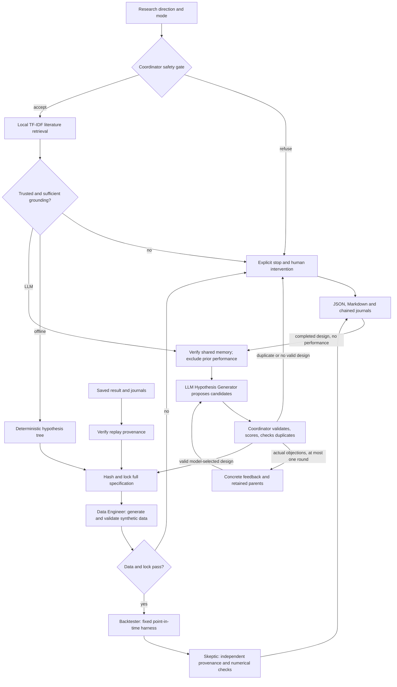

# Investment Signal Research Agent

An investment research idea leaves a lot of questions unanswered. What does "low volatility" mean? How much history should the signal use? Which stocks belong in the portfolio? Those choices need to be made before looking at a backtest.

This capstone project turns a broad question into a documented experiment. It retrieves public research, compares possible definitions, locks a hypothesis, tests it on synthetic prices, and checks the result. It is built for students and research engineers who want to see how each research decision was made and repeat the experiment later.

> **Deterministic synthetic data · Historical research only · Not investment advice · No trade execution · Not evidence of future performance or real-market behavior**

The project runs locally in three ways:

| Mode | What it does | What you need |
|---|---|---|
| **Offline MVP** (default) | Uses a predefined candidate tree and the original 12-month, four-asset experiment | Python; no credentials or network at runtime |
| **LLM-assisted research MVP** | Asks OpenAI to propose research designs and respond to validation feedback | Optional SDK and a locally configured API key |
| **Replay** | Verifies a saved specification and repeats its backtest | The original result and journals; no model call |

**Current verification: 259 tests, 31 offline scenarios, 12 mocked agentic scenarios, and all four real-provider checks passed.** The [capstone evidence handoff](docs/capstone_evidence.md) links to the recorded results and explains what was tested.

## Try it locally

Use Python 3.10 or newer. From the repository folder, run these PowerShell commands:

```powershell
python -m venv .venv
.\.venv\Scripts\python.exe -m pip install .
.\.venv\Scripts\python.exe -m signal_research_agent run --topic "Explore whether lower-volatility stocks have better risk-adjusted returns" --output-dir artifacts/run
```

The base package uses only the Python standard library. Installation may need to download setuptools; the offline workflow itself needs no network access. On macOS or Linux, use `.venv/bin/python` in place of `.\.venv\Scripts\python.exe`.

Open `artifacts/run/research_report.md` when the run finishes. Each completed or refused workflow produces four files:

| File | Contents |
|---|---|
| `result.json` | Structured status, accepted hypothesis, validation, metrics, and review |
| `research_report.md` | A readable account of the experiment and its limitations |
| `audit.jsonl` | The sequence of role actions, decisions, and gate results |
| `research_journal.jsonl` | The hypothesis lock and final research record |

For the default example, the recorded result includes:

```text
Status: completed
Verdict: supported_in_synthetic_fixture_only
Human intervention required: False
Synthetic observations: 108
Synthetic strategy: annualized return=4.7979%, volatility=4.8814%, Sharpe=0.986008
Synthetic benchmark: annualized return=5.8774%, volatility=6.9562%, Sharpe=0.857269
```

The strategy has a higher Sharpe ratio and a lower absolute return in this fixture. The verdict describes that synthetic comparison only. It says nothing about how an investment would perform in real markets.

To inspect the bundled source summaries:

```powershell
.\.venv\Scripts\python.exe -m signal_research_agent corpus
```

## How the agents work together

The Coordinator controls the workflow. A failed gate stops the steps that depend on it, and every backtest starts from a locked specification.



| Role | Responsibility |
|---|---|
| **Coordinator** | Screens the request, routes work, sets budgets, returns feedback, and decides when to stop. |
| **Hypothesis Generator** | Uses literature and prior research to propose a claim, parameters, evidence references, assumptions, and limitations. In offline mode it uses a predefined search. |
| **Data Engineer** | Creates the fixed synthetic price panel and checks its values, histories, dates, and availability. |
| **Backtester** | Executes the locked design, accounts for costs, and compares it with an equal-weight benchmark. |
| **Skeptic** | Independently checks the lock, evidence, audit sequence, data validation, portfolio calculations, and interpretation. |

Only the Hypothesis Generator uses an LLM. The other roles are separate deterministic Python components. Their independence comes from separate responsibilities and checks within one application; it is not human peer review.

### Literature informs the proposal

Local TF-IDF retrieval searches short, original summaries of public research. The generator receives the summaries themselves, stable source IDs, and metadata. Prices and numerical results stay outside this text index.

A literature-based claim must include an eligible source ID and an exact supporting excerpt. The validator rejects invented IDs, changed metadata, fabricated excerpts, and some unsupported claims. These checks make the attribution reviewable, but cannot prove that every claim follows from its source.

For example, the Baker, Bradley, and Wurgler summary motivates studying total volatility. The Ang and coauthors summary distinguishes residual volatility from total volatility. The system keeps that distinction visible. The current backtester supports total volatility; beta or idiosyncratic-volatility requests need an explicit, accurately named adaptation or are deferred.

### Feedback can change the design

In LLM mode, the generator can propose up to three candidates. The Coordinator assesses evidence, methodology, feasibility, fit to the question, and duplication. It keeps a beam of at most two candidates and returns concrete objections when the selected proposal fails validation.

The model can then revise once, proposing up to two children, or defer. Search depth is limited to two, and each run permits at most four provider calls including retries. Candidate scores never use calculated returns or Sharpe ratios. Data generation begins only after the accepted hypothesis is hashed and locked.

The model chooses a 6- or 12-month lookback and 3 or 4 selected assets. Those accepted values determine the experiment. They are design choices, not settings established by the cited papers.

### Memory changes later runs

LLM runs can share an `experiments.jsonl` journal. Before planning, the application verifies the journal and retrieves relevant prior specifications and methodological limitations. Prior returns, Sharpe ratios, rankings, and performance verdicts are excluded from the model's context.

A scientific fingerprint identifies duplicate experiments using their substantive parameters. Changing the topic wording or explanation does not create a new experiment. A duplicate returns the earlier reference and stops before another backtest. Intentional replication requires a user-supplied rationale; changing a parameter when prior experiments exist requires an explicit user constraint.

The [architecture document](docs/architecture.md) covers the schemas, scoring, memory rules, and calculation details.

## Use the LLM mode

Install the optional OpenAI SDK, then enter your key locally. The hidden-input command keeps the key out of your command history:

```powershell
.\.venv\Scripts\python.exe -m pip install ".[llm]"
$env:OPENAI_API_KEY = [System.Net.NetworkCredential]::new('', (Read-Host 'OpenAI API key' -AsSecureString)).Password
$env:OPENAI_MODEL = 'gpt-4.1-mini-2025-04-14'
```

The key is available in that PowerShell session. Keep it out of source files, prompts, logs, and chat. The model setting is optional: the shown snapshot is the default, and `--model` can override it. Verification used OpenAI SDK 2.54.0.

Run a research request with a shared journal:

```powershell
.\.venv\Scripts\python.exe -m signal_research_agent run --mode llm --topic "Explore whether lower-volatility stocks have better risk-adjusted returns" --journal-dir artifacts/shared_journal --output-dir artifacts/llm_run
```

To request specific supported parameters:

```powershell
.\.venv\Scripts\python.exe -m signal_research_agent run --mode llm --topic "Explore lower-volatility stocks with a six-month signal" --lookback-months 6 --selection-count 3 --journal-dir artifacts/shared_journal --output-dir artifacts/llm_run_constrained
```

If that experiment already exists, `duplicate_deferred` is the expected result. To intentionally replicate a recorded six-month, three-asset experiment:

```powershell
.\.venv\Scripts\python.exe -m signal_research_agent run --mode llm --topic "Replicate the historical volatility research design" --lookback-months 6 --selection-count 3 --replication-rationale "Verify repeatability of the recorded experiment in a fresh process" --journal-dir artifacts/shared_journal --output-dir artifacts/llm_run_replication
```

LLM mode uses the official [Responses API](https://developers.openai.com/api/reference/python/resources/responses/methods/create) with [Structured Outputs](https://developers.openai.com/api/docs/guides/structured-outputs). The adapter applies a 30-second HTTP timeout, a 24,000-character context limit, and a default 2,500-token output limit. It records the actual model, response IDs, calls, and supplied usage; unknown usage or cost stays unknown.

Missing credentials, timeouts, provider errors, and exhausted budgets produce explicit stop statuses. The application never reports successful LLM execution after silently falling back to offline mode.

## Replay a saved experiment

Replay verifies a completed run's result, journals, and hypothesis hash, then executes the accepted specification without contacting OpenAI. This example uses a saved genuine LLM run included with the evidence:

```powershell
.\.venv\Scripts\python.exe -m signal_research_agent replay --result artifacts/live_verification/batch_006/A_research/result.json --output-dir artifacts/replay_example
```

Keep the original `result.json`, `audit.jsonl`, and `research_journal.jsonl` together. A replay result cannot itself serve as the source. The application reports exact equality and a numerical tolerance of `1e-12`; larger differences require review. Final floating-point bits may differ across Python versions or platforms.

## Run the checks

The tests and both acceptance suites run without credentials or provider calls:

```powershell
.\.venv\Scripts\python.exe -m unittest discover -s tests -v
.\.venv\Scripts\python.exe -m signal_research_agent evaluate --output-dir artifacts/offline_evaluation
.\.venv\Scripts\python.exe -m signal_research_agent evaluate --suite agentic --output-dir artifacts/agentic_evaluation
```

The agentic suite uses scripted provider responses to test malformed output, grounding failures, actual feedback handling, persistent memory, duplicate detection, supported parameter choices, and refusal paths. These tests are separate from real-provider verification.

| Check | Recorded result |
|---|---|
| Full test suite | **259 passed**, 48.678 seconds |
| Offline acceptance | **31/31 passed** |
| Mocked agentic acceptance | **12/12 passed**, zero real calls |
| Saved replay | Earlier offline specification and genuine LLM specification both passed with zero calls |
| Real-provider verification | **4/4 passed**: research, persisted duplicate prevention, controlled feedback, and explicit choices |

See the [test and acceptance record](artifacts/extension_verification/candidate_identity_fix/verification_results.json) and the separate [live verification record](artifacts/live_verification/live_verification_results.json). The original 97-test baseline remains covered. An earlier 214-test revision was also installed and checked in a clean Python 3.11 environment without the optional SDK; the handoff records that separately from the current suite.

The live feedback example is concrete: initial candidate `r1a` omitted a required same-close/zero-latency limitation. The Coordinator returned that objection, and the model supplied revised child `r2a`. The new design passed validation, was locked, and completed the synthetic backtest and independent review. In the memory example, a second request found the first experiment and prevented redundant execution.

The completed verification sequence used **seven actual calls**, including the earlier failed feedback attempt. Its targeted resume needed only two new calls and retained the verified research, memory, and explicit-choice evidence. Total usage was 29,458 tokens; monetary cost was not supplied. The [handoff](docs/capstone_evidence.md) and [troubleshooting history](docs/live_verification_troubleshooting.md) preserve the failures, resume command, timings, and source references.

To run a new live verification batch after configuring your key:

```powershell
.\.venv\Scripts\python.exe scripts/run_live_verification.py --output-dir artifacts/live_verification
```

This makes real API calls. Each batch allows at most 16 provider attempts, including retries, and preserves its results in a numbered directory. The controlled feedback case deliberately adds a pre-lock validation requirement; it does not change the data or seek a favorable return. The included batch is already verified, so repeating it is optional.

CLI exit codes are `0` for a completed run or passing evaluation, `1` for a failed evaluation, and `2` for a stop requiring attention, including duplicate deferral or incomplete live verification.

## Research boundaries and limitations

All experiments use seed 42, 12 synthetic assets, and 121 month-end prices from December 2014 through December 2024. Every price is labeled synthetic. The 12-month signal produces 108 holding observations; the six-month signal produces 114.

The backtester ranks trailing monthly return volatility using information available at formation. Both the strategy and equal-weight benchmark rebalance monthly and pay 10 basis points per unit of gross traded notional. Turnover uses drifted weights, includes initial investment, and excludes final liquidation. Execution assumes the same month-end close and zero latency.

The Skeptic returns one of three verdicts: `supported_in_synthetic_fixture_only`, `unsupported_in_synthetic_fixture`, or `rejected`. The comparison uses net Sharpe with a zero risk-free rate. A valid unsupported result is still a completed experiment.

The application screens requests before any provider call. It blocks or escalates order execution, brokerage access, personalized advice, private or sensitive data, and empty or ambiguous requests. It also requires human intervention for insufficient or conflicting evidence, unresolved proposal errors, failed data checks, leakage, changed locks, invalid journals, provider failures, or conclusions it cannot support. Retrieved text and journal content are evidence, never instructions granting the model new permissions.

There are deliberate limits to this MVP:

- **Narrow research scope.** Six public sources and four executable parameter combinations cannot cover investment research broadly.
- **Heuristic language checks.** English input screening and excerpt checks can miss subtle problems or reject reasonable wording. Scientific claims still need human review.
- **Simplified data and execution.** The fixture omits delistings, changing constituents, dividends, taxes, market impact, and realistic trading delays. Its results establish no statistical significance or real-market effect.
- **Local integrity.** Append-only SHA-256 journal chains detect inconsistent edits. Without an external checkpoint, they cannot detect a complete rewrite or deletion of a valid tail. Memory is local to the chosen shared directory.
- **Provider variability.** A successful live demonstration does not guarantee every future response will pass. HTTP timeouts are not operating-system deadlines.

## Repository guide

```text
src/signal_research_agent/
  coordinator.py, llm_workflow.py     workflow, feedback, gates, replay
  hypothesis.py, llm_design.py        offline search and LLM design protocol
  provider.py, experiment.py          optional SDK and supported experiments
  retrieval.py, data/literature.json  public research summaries
  memory.py, journal.py               shared memory and append-only records
  data_engineer.py, backtester.py     synthetic data and numerical tests
  skeptic.py, safety.py               independent review and input screening
  cli.py, evaluation.py               commands and offline acceptance
  agentic_evaluation.py               mocked agentic acceptance
scripts/                             evaluation and live verification runners
tests/                               automated tests
docs/architecture.md                 design contracts and formulas
docs/capstone_evidence.md             final report and presentation handoff
artifacts/                           recorded runs and verification evidence
```

## What changed, and what comes next

The first prototype used predetermined hypotheses and stored journals for later inspection. This version lets the LLM write an executable research design, respond to actual objections, and use verified prior work to avoid repeating an experiment. The deterministic baseline remains available for comparison and offline use.

The implementation uses Python, local TF-IDF retrieval, and the optional OpenAI SDK. CrewAI, LangGraph, MCP, learned embeddings, vector databases, additional LLM agents, and live market data are not implemented.

Future work could add a broader reviewed corpus, stronger checks of claim support, externally timestamped locks, separate agent processes, and factor-aware experiments. Research on public market data would also need point-in-time histories, realistic execution assumptions, holdout tests, and controls for repeated experimentation.

## Public sources and license

The corpus contains short original summaries and source metadata. It does not reproduce papers or index numerical datasets as prose.

1. Ang, Hodrick, Xing, and Zhang, [The Cross-Section of Volatility and Expected Returns](https://www.nber.org/papers/w10852).
2. Baker, Bradley, and Wurgler, [Benchmarks as Limits to Arbitrage: Understanding the Low-Volatility Anomaly](https://archive.nyu.edu/handle/2451/29593).
3. Arnott, Harvey, and Markowitz, [A Backtesting Protocol in the Era of Machine Learning](https://people.duke.edu/~charvey/Research/Published_Papers/G138_A_backtesting_protocol.pdf).
4. Bailey, Borwein, López de Prado, and Zhu, [The Probability of Backtest Overfitting](https://escholarship.org/content/qt4w1110bb/qt4w1110bb.pdf).
5. Fama/French Data Library, [Portfolios Formed Monthly on Variance](https://mba.tuck.dartmouth.edu/pages/faculty/ken.french/Data_Library/det_port_form_VAR.html).
6. Fama/French Data Library, [Description of Fama/French Factors](https://mba.tuck.dartmouth.edu/pages/faculty/ken.french/Data_Library/f-f_factors.html).

Code and original summaries are available under the [MIT License](LICENSE). The linked research belongs to its authors and publishers. This project's monthly synthetic experiment is an educational adaptation of research ideas, not a replication of those empirical studies.
