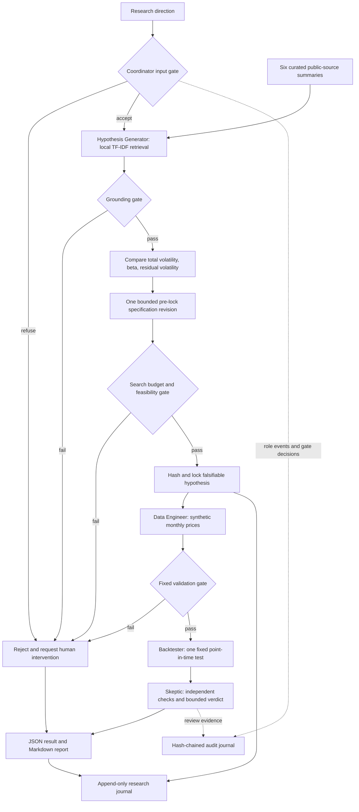

# Investment Signal Research Agent

**Deterministic synthetic data · Historical research only · Not investment advice · No trade execution · Not evidence of future performance**

An offline research assistant that turns a broad question about stock volatility into a locked, falsifiable hypothesis, runs one reproducible synthetic experiment, and records an independent critique with an audit trail. It is designed for students, technical reviewers, and research engineers who want to inspect how evidence, preregistration, data quality, and methodological review fit together.

The capstone demonstrates research process discipline. Synthetic results describe a constructed software fixture and provide **no evidence about real markets**. The program has no trading, brokerage, account access, or personalized-advice functionality.

## What is implemented

Five separate Python components work under a Coordinator. They are deterministic software roles, not five LLMs. The runtime and tests use the Python standard library, without API keys, network calls, proprietary datasets, paid services, or third-party runtime dependencies.



| Role | Responsibility |
|---|---|
| **Coordinator** | Routes the workflow, enforces gates and one pre-lock revision, stops on failure, and writes artifacts. |
| **Hypothesis Generator** | Retrieves curated evidence; compares total volatility, beta, and idiosyncratic volatility using a bounded beam search; locks the feasible specification before data generation. |
| **Data Engineer** | Generates a seeded, explicitly synthetic monthly-price panel and validates schema, prices, histories, dates, and availability. |
| **Backtester** | Executes the unchanged hypothesis with lagged signals, drift-aware turnover, costs, and an equal-weight benchmark. |
| **Skeptic** | Independently checks the lock, grounding, validation, chronology, observations, cost arithmetic, metrics, and permissible interpretation. |

### Retrieval, reasoning, and memory

The six-source corpus contains original short summaries, stable IDs, authors, version metadata, URLs, topics, and interpretation cautions. Local cosine TF-IDF retrieval uses a small explicit synonym map. This is lightweight lexical retrieval with limited semantic normalization; it is not an embedding model or vector database. A fixed methodology query adds grounding about research protocol and overfitting. Numerical prices and returns remain structured data and are never indexed as prose.

The Tree-of-Thought-style search is an inspectable candidate tree with **depth 2, beam width 2, at most 5 visited nodes, and one revision**. Scores use source-topic coverage and offline feasibility. Daily total-volatility research is adapted to the available monthly harness before locking. Beta and residual volatility require factor data and harnesses this MVP does not implement. Search therefore examines alternatives but is intentionally constrained to the one supported total-volatility test. No model generates hidden reasoning or tunes parameters against returns.

The lock includes the signal, asset universe, lookback, holding period, selection rule, benchmark, costs, risk-free rate, success criterion, minimum observations, fixture seed/version/calendar, source IDs, and assumptions. Its canonical JSON produces a full SHA-256 digest and a versioned short ID. Backtesting cannot begin until the lock and data gate pass. There are no post-result revisions or automated parameter sweeps.

`audit.jsonl` records role events and gate evidence. `research_journal.jsonl` retains hypothesis locks and conclusions. Existing valid journals are appended to when an output directory is reused; `result.json` and `research_report.md` then describe the latest run. Use a fresh directory for byte-identical replay. Memory is retained for inspection and is not fed back into hypothesis selection.

## Install

Python **3.10 or newer** is required. From a clone or local copy of this repository:

```bash
python -m venv .venv
```

Activate on macOS/Linux:

```bash
source .venv/bin/activate
```

Activate in Windows PowerShell:

```powershell
.\.venv\Scripts\Activate.ps1
```

If PowerShell activation is restricted, use `.\.venv\Scripts\python.exe` in place of `python` for each command below.

```bash
python -m pip install .
python -m unittest discover -s tests -v
```

`requirements.txt` documents the empty runtime dependency set. Packaging uses setuptools; pip may download build tooling during installation. After installation, all commands below run offline. A source-only alternative, requiring no package download, is to set `PYTHONPATH=src` before running the commands (`$env:PYTHONPATH = "src"` in PowerShell; `export PYTHONPATH=src` in a POSIX shell).

## Run

The single-line commands work in PowerShell and POSIX shells:

```bash
python -m signal_research_agent run --topic "Explore whether lower-volatility stocks have better risk-adjusted returns" --output-dir artifacts/run
python -m signal_research_agent evaluate --output-dir artifacts/evaluation
python -m signal_research_agent corpus
```

The installed `signal-research-agent` command is equivalent to `python -m signal_research_agent`. An evaluation wrapper is also available:

```bash
python scripts/run_evaluation.py --output-dir artifacts/evaluation
```

Each completed or refused workflow creates the following files. Operational failures such as corrupt existing journals, stale writer locks, or insufficient filesystem permissions stop without replacing existing artifacts.

| File | Contents |
|---|---|
| `result.json` | Structured scope notices, hypothesis/search, evidence, validation, monthly attribution, metrics, skeptical verdict, and journal head hashes. |
| `research_report.md` | Readable hypothesis, source links, synthetic metrics, objections, and limitations. |
| `audit.jsonl` | Append-only ordered role events with hash-chain links. |
| `research_journal.jsonl` | Append-only locks and final research conclusions. |

The evaluation command creates `evaluation_results.json`, `sample_console_output.txt`, and all four files under `sample_run/`. Repeating it appends a new sample run to those journals and refreshes the derived evaluation summaries. Fresh temporary directories used by its replay checks are automatically removed.

Exit codes: **0** for a completed research review or successful evaluation, **1** for failed evaluation scenarios, and **2** for a refused/rejected research run or an operational error. `corpus` prints JSON with source metadata and scope notices.

## Fixed synthetic experiment

The fixture contains 12 artificial assets and 121 month-end prices per asset, from December 2014 through December 2024. The generator uses seed 42, a common random factor, increasing asset-specific noise, and identical expected log-return drift. Every row has `synthetic: true`, an observation date, and an availability date. Parameters are chosen for a reproducible software exercise, without fitting real data or rerunning seeds until a desired verdict appears.

At each formation close, the strategy ranks sample standard deviations of the preceding 12 monthly simple returns and equally weights the four lowest-volatility assets. Alphabetical asset IDs resolve ties. It holds for the following month. The benchmark rebalances all 12 assets equally each month. This gives 108 evaluated monthly holding periods.

Both portfolios pay 10 basis points per unit of gross traded notional, including initial investment. Turnover uses absolute changes from weights drifted by prior asset returns; a full replacement has turnover 2. Costs reduce capital before the next return: `(1 - cost) * (1 + gross_return) - 1`. There is no final liquidation. `total_cost_fraction` sums period cost fractions and is not a currency amount or the cumulative performance drag. Sharpe uses the arithmetic mean and sample standard deviation of net monthly returns, a zero risk-free rate, and annualization by `sqrt(12)`. Maximum drawdown includes starting wealth of 1.

The same-close formation and execution convention assumes instant access and zero latency. Delayed availability is rejected, rather than backfilled. This simplifying assumption is visible in the lock and is unsuitable as a claim about executable real-market returns.

The preregistered descriptive rule is `strategy_net_sharpe > benchmark_net_sharpe`. It does not test statistical significance. Review can return only:

- `supported_in_synthetic_fixture_only`
- `unsupported_in_synthetic_fixture`
- `rejected`

## Evaluation and measured results

The evaluation runner executes named software-acceptance scenarios for workflow completion, all roles, grounding, pre-outcome search, repeatability, refusals, malformed data, leakage, hypothesis tampering, chain integrity, gate stopping, and cost application. The separate unittest suite adds arithmetic checks and adversarial integration tests. Counts, timings, environment information, and sample metrics are recorded from actual executions in [evaluation_results.json](artifacts/evaluation/evaluation_results.json) and [verification_results.json](artifacts/evaluation/verification_results.json). These measure software behavior, not investment efficacy.

Actual verification on Windows:

| Check | Measured result |
|---|---|
| Installed package, Python 3.13.5 | **97 tests passed**, 10.390 seconds in the test runner |
| Acceptance evaluation, Python 3.13.5 | **31/31 passed**, 1.408 seconds |
| Isolated source copy, fresh environment, Python 3.11.9 | Install succeeded; **97 tests passed**, 10.470 seconds |
| Isolated copy CLI checks | Evaluation **31/31 passed**; example workflow and corpus command succeeded |
| Offline execution | Full workflow passed with socket creation disabled in a test |
| Publication scan | No detected credential patterns, unfinished/conflict markers, or trailing whitespace in intended files |

Git operations and publication are left to the repository owner. Verification used an isolated source copy instead of creating a Git checkout, and full-file whitespace checks instead of running `git diff --check`.

The two Python versions produced the same hypothesis ID, synthetic data hash, and verdict. Computed numeric fields differed by at most `3.56e-15`, which also changes downstream journal hashes. Exact byte replay passes within each tested interpreter; cross-version byte identity is not promised.

Example console output from the documented research direction:

```text
Offline MVP | Deterministic synthetic data | Historical research only | Not investment advice | No trade execution | Not evidence of future performance
Status: completed
Verdict: supported_in_synthetic_fixture_only
Human intervention required: False
Synthetic observations: 108
Synthetic strategy: annualized return=4.7979%, volatility=4.8814%, Sharpe=0.986008
Synthetic benchmark: annualized return=5.8774%, volatility=6.9562%, Sharpe=0.857269
Artifacts: artifacts/run
```

Measured **synthetic fixture only** metrics:

| Metric | Low-volatility strategy | Equal-weight benchmark |
|---|---:|---:|
| Net cumulative return | 52.4657% | 67.1980% |
| Net annualized return | 4.7979% | 5.8774% |
| Annualized volatility | 4.8814% | 6.9562% |
| Sharpe, zero risk-free rate | 0.986008 | 0.857269 |
| Maximum drawdown | -8.2936% | -9.4275% |
| Average monthly gross turnover | 0.130212 | 0.033161 |
| Sum of period cost fractions | 0.014063 | 0.003581 |
| Evaluated months | 108 | 108 |

The strategy has a higher Sharpe but a lower absolute return in this fixture. The bounded verdict follows the locked Sharpe comparison. None of these numbers supports a conclusion about real stocks or future performance.

See the checked-in [console summary](artifacts/evaluation/sample_console_output.txt), [sample research report](artifacts/evaluation/sample_run/research_report.md), and [structured sample](artifacts/evaluation/sample_run/result.json). Runtime timings vary by machine; replay assertions compare research artifacts, not benchmark timing fields.

## Safety and human intervention

Transparent English pattern rules reject trade/order actions, brokerage access, personalized advice, sensitive/private/proprietary data, empty directions, and materially ambiguous or out-of-scope requests. Refused request text is not copied into the journals or report. Accepted public research directions are recorded. The filter is intentionally conservative, can reject negations, and cannot reliably understand arbitrary language or detect every secret; do not submit sensitive information. The CLI accepts a topic, not uploaded data or credentials.

Human intervention is required when grounding is insufficient or explicitly conflicting, validation fails, observation/availability leakage appears, a lock changes, a request crosses the research boundary, or the review cannot support a reliable synthetic-fixture conclusion. Failure stops downstream work; it does not automatically relax a constraint, fetch new data, or retry until a favorable outcome appears. Normal unsupported fixture results are valid completed research outcomes.

Journals use canonical SHA-256 chaining, append-only writes, writer locks, and flush-to-disk. Corrupt existing journals are refused. Hashes detect changes against the current chain, but cannot establish truth, resist a writer who recomputes the entire chain, or detect deletion of a valid tail without an external checkpoint. Sidecar `.lock` files left after a crash require operator inspection before removal. Neither journal is a security sandbox or a signed third-party preregistration service.

## Repository map

```text
investment-signal-research-agent/
├── README.md, LICENSE, .gitignore
├── pyproject.toml, requirements.txt
├── docs/architecture.md
├── src/signal_research_agent/
│   ├── __init__.py, __main__.py, cli.py, models.py
│   ├── coordinator.py, hypothesis.py, data_engineer.py
│   ├── backtester.py, skeptic.py
│   ├── retrieval.py, safety.py, journal.py, evaluation.py
│   └── data/literature.json
├── scripts/run_evaluation.py
├── tests/test_*.py
└── artifacts/evaluation/
    ├── evaluation_results.json, sample_console_output.txt
    ├── verification_results.json, test_console_output.txt
    └── sample_run/
        ├── result.json, research_report.md
        └── audit.jsonl, research_journal.jsonl
```

## Limitations and planned improvements

This is a deterministic offline MVP. There is no CrewAI, LangGraph, MCP integration, vector database, or LLM in the repository. Role independence means separate components and independent checks within one process; it is not process isolation or independent human judgment. The curated corpus is small, conflicts are curated metadata rather than automatically inferred scientific disagreement, and retrieval has limited vocabulary. The only executable signal is monthly total volatility.

Synthetic prices omit dividends, corporate actions, taxes, delistings, changing universe membership, capacity, and real execution constraints. A balanced fabricated universe cannot resolve survivorship bias. No significance test, uncertainty interval, holdout tuning study, real-market validation, or generalization claim is made. Python floating-point math may differ in its final bits across platforms; exact replay is tested in the documented environment. Per-run files and journals are local and are not a production multi-user database.

Planned production work includes a reviewed point-in-time public-data adapter, factor-aware hypotheses, immutable externally timestamped preregistration, richer retrieval with source review, process isolation, broader multilingual safety evaluation, holdout and multiple-testing controls, and more realistic execution assumptions. CrewAI/LangGraph, MCP tools, embeddings, and an LLM are possible future architecture choices, not implemented features. Any production research system should retain the research-only boundary.

## Public sources

The corpus contains original summaries and metadata, not copies of papers or numerical datasets. Linked versions sometimes differ from subsequent journal publication years; metadata records that distinction. The Fama/French library pages describe methodology and do not supply prices to this MVP.

1. Ang, Hodrick, Xing, and Zhang, [The Cross-Section of Volatility and Expected Returns](https://www.nber.org/papers/w10852).
2. Baker, Bradley, and Wurgler, [Benchmarks as Limits to Arbitrage: Understanding the Low-Volatility Anomaly](https://archive.nyu.edu/handle/2451/29593).
3. Arnott, Harvey, and Markowitz, [A Backtesting Protocol in the Era of Machine Learning](https://people.duke.edu/~charvey/Research/Published_Papers/G138_A_backtesting_protocol.pdf).
4. Bailey, Borwein, López de Prado, and Zhu, [The Probability of Backtest Overfitting](https://escholarship.org/content/qt4w1110bb/qt4w1110bb.pdf).
5. Fama/French Data Library, [Portfolios Formed Monthly on Variance](https://mba.tuck.dartmouth.edu/pages/faculty/ken.french/Data_Library/det_port_form_VAR.html).
6. Fama/French Data Library, [Description of Fama/French Factors](https://mba.tuck.dartmouth.edu/pages/faculty/ken.french/Data_Library/f-f_factors.html).

See [architecture.md](docs/architecture.md) for component contracts, formulas, and the integrity threat model. The original code and original corpus summaries are MIT licensed; external research remains the property of its respective authors and publishers.

**Deterministic synthetic data. Historical research only. Not investment advice. No trade execution. Not evidence of future performance.**
