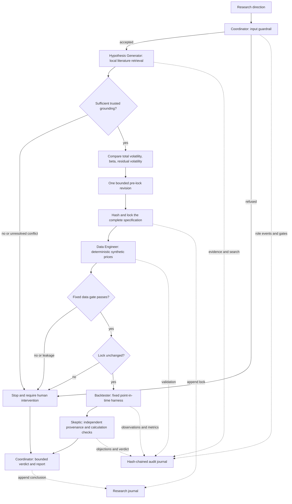

# Architecture and research contract

**Offline MVP | Deterministic synthetic data | Historical research only | Not investment advice | No trade execution | Not evidence of future performance**

This repository demonstrates an auditable research process with five independently implemented Python roles. Each role is a local component with an explicit input contract. No language model, CrewAI, LangGraph, MCP service, vector database, external factor download, brokerage connection, or runtime network request is part of this implementation. The Python standard library supplies retrieval, simulation, statistics, serialization, and orchestration.

The synthetic comparison checks software behavior and a preregistered descriptive rule. It cannot establish whether a financial anomaly exists in real markets.

## Roles, routing, and stopping rules



| Component | Receives | Responsibility and boundary |
|---|---|---|
| Coordinator | Topic and output directory | Routes dependencies, owns gates and the one-revision limit, writes artifacts, and stops at failed gates. |
| Hypothesis Generator | Topic and curated evidence records | Compares a fixed candidate tree using grounding and feasibility, then returns a content-addressed lock. Its API accepts no price panel or backtest results. |
| Data Engineer | Locked specification | Creates the deterministic fixture and validates its schema, history, prices, synthetic labels, and availability. It does not choose the hypothesis. |
| Backtester | Lock, rows, validation attestation | Revalidates the actual rows, verifies the supported specification, and runs one fixed strategy. It neither searches nor changes the lock. |
| Skeptic | Lock, evidence, validation, backtest, audit entries, and rows | Independently recomputes integrity and numerical invariants, records objections, and issues a bounded verdict. It does not call the backtest implementation to review its arithmetic. |

Workflow state is enforced by ordered Python control flow and recorded event names, rather than a third-party graph engine or state-machine framework. A successful run records `request_accepted`, `evidence_retrieved`, `search_completed`, an optional `hypothesis_revised`, `hypothesis_locked`, `data_generated`, `data_validated`, `backtest_started`, `backtest_completed`, `review_completed`, and `workflow_completed`. Failed gates record `workflow_stopped`; an input refusal also records `request_refused`. The final result has status `completed` or `rejected`.

There is no automatic retry after data validation or backtesting. Revision is limited to methodology feasibility before locking. Outcomes cannot trigger another candidate search, a new parameter choice, or a second backtest within the run. Separate user-initiated runs remain possible and are journaled; this does not prevent a human from inspecting many different experiments outside the process.

## Input boundary

The guardrail is a transparent, conservative English rule set. It rejects brokerage references, trade/order actions, personalized advice, private or sensitive information, empty or oversized input, and requests without enough volatility-research context. Refusal artifacts store the decision and reason without reproducing the submitted text. The run identifier includes a hash of the request, which is not encryption or protection against guessing predictable inputs.

These rules are not a general semantic classifier. Negated boundary terms can cause false refusals, and unfamiliar phrasing can evade a keyword rule. The implementation's stronger capability boundary is structural: it has no order API, account connector, external data ingestion path, or live-market access. Accepted requests always enter the same narrow historical synthetic research workflow.

A request outside that workflow requires human intervention; the program never attempts to obtain brokerage access or convert a refusal into an executable action.

## Retrieval and attribution

`literature.json` contains six short original summaries, stable IDs, source URLs, authors, version-aware publication metadata, topics, stance labels, and a review date. Source papers are linked, not copied. Fama/French entries describe methodology only: numerical portfolio and factor returns are neither bundled nor indexed as prose. The retriever refuses entries marked as numerical datasets.

Retrieval tokenizes lowercase alphabetic words, removes an explicit stop-word set, and applies a fixed synonym map. For example, `equities`, `equity`, and `stocks` map to `stock`; `variance` and `volatile` map to `volatility`; `returns` maps to `return`; and `backtest` maps to `backtesting`. This is lightweight lexical similarity with declared domain normalization, not learned semantic embeddings. Collapsing variance and volatility helps retrieval but does not make their numerical definitions interchangeable in the harness.

For document frequency `df(w)` among `D` documents, the index uses:

```text
idf(w) = log((1 + D) / (1 + df(w))) + 1
weight(w, document) = (1 + log(term_count(w, document))) * idf(w)
```

Document and query vectors are normalized to unit Euclidean length. Their dot product is cosine similarity. Only positive matches are returned, ordered by descending score and then source ID; published scores are rounded to 12 decimal places. The indexed fields are title, summary, and topics. The Coordinator merges topic matches with a fixed methodology query for backtesting, research protocol, and overfitting, deduplicating by source ID.

The Hypothesis Generator checks supplied metadata against the bundled source records, accepts only the optional retrieval score as an extra field, and requires at least three distinct sources, including direct total-volatility research and a methodological caution source. Unknown, altered, explicitly conflicting, or insufficient sources stop the workflow. The bundled corpus contains methodological cautions and differences of definition; these are limitations rather than automatically contradictory findings. The code detects explicit conflict annotations and metadata changes, not arbitrary contradictions in natural-language literature.

The source distinctions matter:

| Stable source ID | Role in this implementation |
|---|---|
| `ang-2004-volatility` | Motivates residual-volatility research. Its factor-model residual signal is not the implemented total-volatility signal. The linked NBER working paper is from 2004; its journal version is from 2006. |
| `baker-2010-benchmarks` | Grounds both total-volatility and beta candidates and discusses benchmark-related explanations. The metadata follows the 2010 NYU working-paper record. |
| `arnott-2019-protocol` | Motivates falsifiability, prior specification, and protection against performance-driven revisions. |
| `bailey-2017-overfitting` | Motivates recording the search budget and limiting selection effects. The repository publication year is 2017; the linked manuscript is revised February 2015. The probability-of-overfitting estimator is not implemented. |
| `french-variance-methodology` | Illustrates lagged monthly portfolio formation from daily-return variance: a 60-day window with at least 20 observations. The monthly-data MVP is an adaptation, not a replication. |
| `french-factor-methodology` | Explains market, size, and value factor context. The required dated numerical factor panel is absent from this MVP. |

The two maintained French methodology pages have `year: null`; `reviewed_on` records the corpus review date instead of inventing a publication year. URLs in the corpus and generated reports provide direct attribution.

## Bounded exploration and immutable specification

The deterministic search is Tree-of-Thought-style candidate exploration over an explicit, predefined tree. It is not an LLM's hidden reasoning or unrestricted autonomous model invention.

At depth one, all three definitions are evaluated: total volatility using daily returns, beta against an independently specified market factor, and residual volatility from an explicit factor regression. Grounding score is the number of distinct retrieved sources tagged for that definition. The complete ranking rule is:

```text
candidate score = grounding source count + 4 * feasibility score
```

Initial total-volatility feasibility is `0.75` because the daily method can be adapted to the monthly harness; beta and residual volatility receive `0` because the required factor inputs and harnesses are absent. These are declared engineering heuristics, not estimated probabilities or performance forecasts. Retrieval similarity scores do not affect candidate ranking.

The best two candidates survive the first beam. At depth two, total volatility receives the only allowed revision: substitute the fixed sample standard deviation of 12 monthly returns for the unavailable daily-return method. Its feasibility becomes `1`. The other surviving branch remains infeasible. The search stops at depth two after five visited nodes and at most one revision, selecting the highest-ranked feasible grounded branch. No numerical experiment is run to rank candidates.

The specification locks the version, normalized topic, signal, 12 synthetic asset IDs, 12-month lookback, one-month holding period, four selected assets, equal-weight benchmark, 10-basis-point cost rate, zero risk-free rate, historical cutoff, minimum observation count, success rule, generator seed/version/date range, assumptions, and grounding source IDs. Canonical JSON uses sorted keys, compact separators, UTF-8, and finite JSON numbers. The content hash is SHA-256 of that complete JSON specification; the ID is `hyp-v1-` followed by its first 16 hexadecimal hash characters. Verification checks both the full hash and the ID.

Copies isolate component inputs from accidental mutation. The Coordinator persists the lock before generating prices, and the Backtester checks it before and after execution. A content hash alone cannot prevent a writer from constructing a different valid hash; the recorded original lock and audit ordering provide the comparison against which later modifications are checked.

## Synthetic data and validation

The fixture contains 121 month-end prices per asset for `SYN01` through `SYN12`, from December 2014 through December 2024: 1,452 observations in total. Each observation has `asset`, `date`, `available_at`, `price`, and `synthetic: true`. Initial prices are 100; availability equals the observation date.

The generator uses isolated `random.Random(42)` state and a Box-Muller transformation of uniform random numbers. At each month, asset index `j` from 0 through 11 receives:

```text
log_return(j, month) = 0.005
                    + (0.009 + 0.0015 * j) * common_normal_shock(month)
                    + (0.008 + 0.004 * j) * independent_normal_shock(j, month)
next_price = round(previous_price * exp(log_return), 8)
```

This deliberately controlled common-factor/dispersion fixture is not fitted to observed data. All assets have the same log-return drift, not necessarily the same expected simple return. The design makes risk characteristics vary across assets, so its outcome cannot be treated as an unbiased test of a real-market hypothesis. Prices are generated only after the specification is locked, though the generator's public source code is available to a human reader.

The data gate checks schema, duplicate asset/date rows, missing values, finite positive prices, sufficient history, equal histories across assets, the exact locked universe, contiguous month-end dates, the expected start and length, availability dates, the as-of cutoff, and explicit synthetic labels. A 12-month lookback and minimum 36 evaluated months require at least 49 prices per asset. The baseline has 121. Both late availability and a claimed availability before the observation date are rejected because this fixed harness requires availability exactly at the formation close.

Validation returns individual checks, all errors, dimensions, and a canonical data hash. The Backtester independently reruns this gate and requires exact agreement with the supplied validation attestation. Failures or availability leakage stop the run and require human intervention; the system does not impute prices or silently shorten histories.

## Point-in-time backtesting formulas

Let `P(i,t)` be asset `i`'s synthetic price at month-end `t`, and define its simple monthly return as `r(i,t) = P(i,t) / P(i,t-1) - 1`. At formation time `t`, the signal is the sample standard deviation of returns `r(i,t-11)` through `r(i,t)`, with denominator `12 - 1`. Those 12 returns require 13 prices, from `t-12` through `t`.

The four lowest signal values receive weights of `1/4`; ties are resolved by asset ID. The benchmark gives every asset weight `1/12` each month. Both portfolios then receive the following month's simple return. The first formation is December 2015, and evaluated returns run from January 2016 through December 2024, yielding `121 - 12 - 1 = 108` observations.

The harness assumes prices can be observed and positions rebalanced at the same month-end close with zero latency. This is an explicit simulation convention, not a realistic execution guarantee. No forward return participates in the formation signal.

For either portfolio, prior weights drift after the prior holding period. With prior target weight `w(i,t-1)` and prior portfolio gross return `g(t)`, the weights available before the next rebalance are:

```text
drifted_weight(i,t) = w(i,t-1) * (1 + r(i,t)) / (1 + g(t))
turnover(t) = sum_i abs(target_weight(i,t) - drifted_weight(i,t))
cost_fraction(t) = turnover(t) * 10 / 10000
gross_return(t+1) = sum_i target_weight(i,t) * r(i,t+1)
net_return(t+1) = (1 - cost_fraction(t)) * (1 + gross_return(t+1)) - 1
```

Turnover is total absolute traded weight, without a factor of one-half. Initial pre-rebalance weights are zero, so the initial purchase has turnover one. This convention charges both the strategy and benchmark, including entry; no final liquidation is charged. Transaction costs are a proportional haircut before the holding return. They do not introduce a cash holding into the next period's normalized weights.

For `N` net monthly returns `R(t)`, the summary statistics are:

```text
wealth(t) = product_{k=1..t} (1 + R(k)); wealth(0) = 1
cumulative_return = wealth(N) - 1
annualized_return = wealth(N) ** (12 / N) - 1
annualized_volatility = sample_std(R) * sqrt(12)
Sharpe = mean(R) / sample_std(R) * sqrt(12)   [risk-free rate fixed at zero]
maximum_drawdown = min_t(wealth(t) / max_{s=0..t} wealth(s) - 1)
average_monthly_turnover = mean(turnover)
total_turnover = sum(turnover)
total_cost_fraction = sum(cost_fraction)
observation_count = N
```

Drawdown is zero or negative and includes the initial wealth peak. Undefined Sharpe ratios cannot support a reliable verdict. `total_cost_fraction` sums fractions of different months' pre-rebalance wealth; it is neither a dollar expenditure nor the difference between gross and net compounded wealth.

## Skeptical review and interpretation

The Skeptic verifies the original hypothesis record and full hash, source grounding, audit integrity, event order, search budget, outcome isolation, data provenance and availability, validation attestation, observation count, signal calculations, selected assets and weights, turnover, costs, reported summary statistics, and synthetic interpretation. Numerical comparisons allow small floating-point tolerance. Its checks are independently coded within the same Python application; this is not organizational independence, a security sandbox, or human peer review.

Any failed required check produces `rejected` and requires human intervention. Otherwise, the locked rule compares the two net Sharpe ratios: a strictly higher strategy Sharpe produces `supported_in_synthetic_fixture_only`; all other defined comparisons produce `unsupported_in_synthetic_fixture`. These are descriptive labels for one fixture. A lack of objections permits only the fixture-level conclusion and does not authorize real-market interpretation.

There are no confidence intervals, p-values, causal identification, multiple-testing adjustment, CSCV/PBO estimator, holdout validation against real data, or forward-performance prediction. The reported confidence is explicitly limited to deterministic fixture checking. Human intervention is required whenever the process cannot support even that bounded conclusion reliably.

## Persistence, determinism, and integrity limits

The Coordinator creates four public run artifacts: `result.json`, `research_report.md`, `audit.jsonl`, and `research_journal.jsonl`. The first two are derived views replaced atomically on a subsequent run in the same directory. The JSONL files accumulate entries; application code never truncates or rewrites them. The research journal retains the pre-outcome lock and final conclusion with verdict, source IDs, metrics, and provenance hashes. The audit contains role events, evidence, search trace, validation, and detailed backtest observations.

This memory is an append-only research record, not an adaptive learner. Previous successful metrics are not fed into the generator. The original price panel is reproducible from the locked generator configuration and validated against its data hash; the run artifacts do not store a second full price dataset.

Each journal entry contains `sequence`, `previous_hash`, `payload`, and `entry_hash`. The first previous hash is 64 zeroes. The entry hash covers canonical JSON of the other three fields. Readers check exact shape, consecutive sequence numbers, links, payload hashes, valid UTF-8 JSONL, and a complete newline-terminated final entry. Every append rechecks the chain, writes with append mode, and flushes the file to disk. Exclusive sidecar locks refuse overlapping application writers; a crashed process can leave a lock requiring inspection before recovery.

The result includes both journal head hashes. The recorded result digest is computed before adding this final `integrity` object, avoiding a circular hash dependency. An external verifier should remove `integrity` before comparing that result digest.

These unkeyed local chains detect accidental corruption and edits that disagree with the current chain. They do not prove who wrote an entry, protect against an attacker controlling the filesystem, detect deletion of a valid final segment, or detect rewriting the whole chain with new hashes. There is no external trusted checkpoint, cryptographic signature, or remote append-only store. Atomic summary replacement and individual journal appends are not a transaction across all four files; an interrupted run may require recovery and cannot be assumed completed.

Fresh output directories reproduce scientific content and IDs on the same runtime. A repeated run in the same directory receives a different run ID because that ID also includes the prior audit length. Evaluation elapsed times intentionally vary. Python's pseudorandom stream is seeded, but differences in mathematical libraries and floating-point behavior across platforms or interpreter versions can affect final bits; universal cross-platform byte identity is not claimed.

## Deliberate extension boundary

Production improvements would require separate engineering and research validation: broader independently curated literature, semantic retrieval with explicit provenance, authenticated source snapshots, real point-in-time structured data under appropriate licenses, investable universe history and delistings, realistic execution delay and costs, externally anchored journals, statistical robustness analysis, and human review of conflicting research. An LLM or graph-orchestration framework could assist that future workflow, with the existing lock and data gates remaining explicit.

Those components are planned architecture only. None is necessary to run or evaluate this offline MVP, and none changes its present historical-research-only scope.
