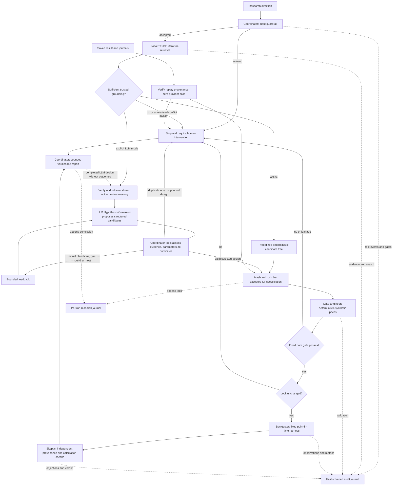

# Architecture and research contract

**Offline MVP or explicitly selected LLM-assisted research MVP | Deterministic synthetic data | Historical research only | Not investment advice | No trade execution | Not evidence of future performance**

This repository implements five separate research roles with explicit contracts. The default offline mode retains the deterministic prototype. Explicit LLM mode replaces its predefined hypothesis selection with provider-generated structured research designs, deterministic validation feedback, and verified persistent memory. Saved-specification replay executes an accepted experiment without calling a model. Retrieval, simulation, statistics, integrity checks, and orchestration use the Python standard library; LLM mode optionally uses the official OpenAI Python SDK.

Only the Hypothesis Generator uses a language model. The implementation does not use CrewAI, LangGraph, MCP, a vector database, learned embeddings, factor downloads, brokerage connectors, or live market data. The optional provider request sends the screened research direction, public summaries, outcome-free prior specifications, and bounded validation observations to the fixed OpenAI endpoint. Offline and replay execution require no credentials or network access. Implementation and mocked verification are separate from real-provider verification; the measured evidence and any uncompleted live demonstrations are recorded in [capstone_evidence.md](capstone_evidence.md).

The synthetic comparison checks software behavior and a preregistered descriptive rule. It cannot establish whether a financial anomaly exists in real markets.

## Roles, routing, and stopping rules



| Component | Receives | Responsibility and boundary |
|---|---|---|
| Coordinator | Topic, explicit mode, output directory, optional shared journal and supported constraints | Owns actions, retrieval, validation observations, feedback, budgets, duplicate decisions, locking, artifacts, and stopping rules. |
| Hypothesis Generator | Topic, retrieved public summaries, supported choices; in LLM mode, verified outcome-free memory and actual feedback | Offline: compares the predefined tree. LLM: proposes candidates and can revise their research claims and executable choices. It receives no price panel or calculated outcomes and has no callable tools. |
| Data Engineer | Locked specification | Creates the deterministic fixture and validates its schema, history, prices, synthetic labels, and availability. It does not choose the hypothesis. |
| Backtester | Lock, rows, validation attestation | Revalidates the actual rows, verifies the supported specification, and runs one fixed strategy. It neither searches nor changes the lock. |
| Skeptic | Lock, evidence, validation, backtest, audit entries, and rows | Independently recomputes integrity and numerical invariants, records objections, and issues a bounded verdict. It does not call the backtest implementation to review its arithmetic. |

Workflow state is enforced by Python control flow and independently checked audit event order. Both research modes record `request_accepted`, `evidence_retrieved`, `search_completed`, `hypothesis_locked`, `data_generated`, `data_validated`, `backtest_started`, `backtest_completed`, `review_completed`, and `workflow_completed` when successful. Offline mode preserves its optional `hypothesis_revised` event. LLM mode records `memory_retrieved`, each `provider_call_completed`, `candidates_assessed`, and any actual `feedback_issued` before `search_completed`. Replay records `replay_loaded` and no provider event. Failed gates record `workflow_stopped`; input refusals record `request_refused`.

The numerical verdict remains bounded to the three original labels. Execution status additionally distinguishes missing credentials, unavailable SDK, provider errors or timeouts, exhausted call or revision budgets, failed grounding or validation, duplicate deferral, and integrity failures. A successful mock adapter cannot establish real-provider execution. The application records adapter-observed provider metadata separately from candidate JSON.

There is no automatic retry after data validation or backtesting. Revision is limited to pre-lock research design. Outcomes cannot trigger another candidate search, parameter change, or second backtest within a run. Shared memory prevents redundant LLM execution unless the user explicitly supplies a replication rationale; supported parameter constraints are needed to authorize changed experiments when prior designs exist. This does not prevent a human from inspecting many experiments outside the process or using separate journal directories.

## Input boundary

The guardrail is a transparent, conservative English rule set. It rejects brokerage references, trade/order actions, personalized advice, private or sensitive information, empty or oversized input, and requests without enough volatility-research context. Refusal artifacts store the decision and reason without reproducing the submitted text. The run identifier includes a hash of the request, which is not encryption or protection against guessing predictable inputs.

These rules are not a general semantic classifier. Negated boundary terms can cause false refusals, and unfamiliar phrasing can evade a keyword rule. The stronger capability boundary is structural: the model cannot call tools, execute generated code, connect to accounts, ingest numerical data, or alter the harness. The provider adapter has one fixed research-design operation. A separate conservative instruction-injection and sensitive-token screen treats retrieved content, memory, and provider output as untrusted. Exact corpus comparison and allowlist projections provide additional controls; pattern matching does not solve arbitrary natural-language injection.

A request outside that workflow requires human intervention; the program never attempts to obtain brokerage access or convert a refusal into an executable action.

## Retrieval and attribution

`literature.json` contains six short original summaries, stable IDs, source URLs, authors, version-aware publication metadata, topics, stance labels, and a review date. Source papers are linked, not copied. Fama/French entries describe methodology only: numerical portfolio and factor returns are neither bundled nor indexed as prose. The retriever refuses entries marked as numerical datasets.

Retrieval tokenizes lowercase alphabetic words, removes an explicit stop-word set, and applies a fixed synonym map. For example, `equities`, `equity`, and `stocks` map to `stock`; `variance` and `volatile` map to `volatility`; `returns` maps to `return`; and `backtest` maps to `backtesting`. This is lightweight lexical similarity with declared domain normalization, not learned semantic embeddings. Collapsing variance and volatility helps retrieval but does not make their numerical definitions interchangeable in the harness.

For document frequency `df(w)` among `D` documents, the index uses:

```text
idf(w) = log((1 + D) / (1 + df(w))) + 1
weight(w, document) = (1 + log(term_count(w, document))) * idf(w)
```

Document and query vectors are normalized to unit Euclidean length. Their dot product is cosine similarity. Only positive matches are returned, ordered by descending score and then source ID; published scores are rounded to 12 decimal places. The indexed fields are title, summary, and topics. The Coordinator merges topic matches with a fixed methodology query for backtesting, research protocol, and overfitting, deduplicating by source ID.

The Hypothesis Generator checks supplied metadata against the bundled source records, accepts only the optional retrieval score as an extra field, and requires at least three distinct sources, including direct total-volatility research and a methodological caution source. Unknown, altered, explicitly conflicting, or insufficient sources stop the workflow. The bundled corpus contains methodological cautions and differences of definition; these are limitations rather than automatically contradictory findings. The code detects explicit conflict annotations and metadata changes, not arbitrary contradictions in natural-language literature.

LLM planning receives the actual original summaries, stable IDs, and curated metadata, not just titles or URLs. Every declared literature claim must include an eligible source ID and an exact supporting substring of that retrieved summary. Each executable candidate needs a supported direct total-volatility claim and a methodological-caution claim. The deterministic support check also requires minimal content-word overlap between each claim and excerpt and rejects obvious proof or guarantee language. Removing direct grounding prevents an executable total-volatility proposal from proceeding.

This is reviewable attribution and limited lexical support checking, not semantic entailment. A misleading claim can share words with a valid excerpt, and automated validation cannot reliably discover all uncited factual claims inside explanatory prose. The prompt therefore requires literature-based claims in `evidence_claims`, while assumptions and parameter choices are labeled separately. Human review remains necessary to judge source-to-claim meaning and unresolved conflicts.

The source distinctions matter:

| Stable source ID | Role in this implementation |
|---|---|
| `ang-2004-volatility` | Motivates residual-volatility research. Its factor-model residual signal is not the implemented total-volatility signal. The linked NBER working paper is from 2004; its journal version is from 2006. |
| `baker-2010-benchmarks` | Grounds both total-volatility and beta candidates and discusses benchmark-related explanations. The metadata follows the 2010 NYU working-paper record. |
| `arnott-2019-protocol` | Motivates falsifiability, prior specification, and protection against performance-driven revisions. |
| `bailey-2017-overfitting` | Motivates recording the search budget and limiting selection effects. The repository publication year is 2017; the linked manuscript is revised February 2015. The probability-of-overfitting estimator is not implemented. |
| `french-variance-methodology` | Illustrates lagged monthly portfolio formation from daily-return variance: a 60-day window with at least 20 observations. The monthly-data MVP is an adaptation, not a replication. |
| `french-factor-methodology` | Explains market, size, and value factor context. The required dated numerical factor panel is absent from this MVP. |

The two maintained French methodology pages have `year: null`; `reviewed_on` records the corpus review date instead of inventing a publication year. URLs in the corpus and generated reports provide direct attribution.

## Bounded exploration and immutable specification

### Preserved offline search

The offline search remains Tree-of-Thought-style candidate exploration over an explicit, predefined tree. Its choices and revision are deterministic; this mode does not claim language-model reasoning.

At depth one, all three definitions are evaluated: total volatility using daily returns, beta against an independently specified market factor, and residual volatility from an explicit factor regression. Grounding score is the number of distinct retrieved sources tagged for that definition. The complete ranking rule is:

```text
candidate score = grounding source count + 4 * feasibility score
```

Initial total-volatility feasibility is `0.75` because the daily method can be adapted to the monthly harness; beta and residual volatility receive `0` because the required factor inputs and harnesses are absent. These are declared engineering heuristics, not estimated probabilities or performance forecasts. Retrieval similarity scores do not affect candidate ranking.

The best two candidates survive the first beam. At depth two, total volatility receives the only allowed revision: substitute the fixed sample standard deviation of 12 monthly returns for the unavailable daily-return method. Its feasibility becomes `1`. The other surviving branch remains infeasible. The search stops at depth two after five visited nodes and at most one revision, selecting the highest-ranked feasible grounded branch. No numerical experiment is run to rank candidates.

### LLM design and real validation feedback

`llm_design.py` defines prompt version `research-design-v3` and provider schema version `research-proposal-v4`. Its strict object schema requires candidate and parent IDs, research claim, signal, lookback, selection count, evidence claims and excerpts, assumptions, concise decision rationale, limitations, parameter basis, and any adaptation rationale. The provider schema is derived from the current round: initial output permits `propose` or `defer`, at most three candidates and null parents; revision output permits `revise` or `defer`, at most two candidates and only actual retained parent IDs. The application reserves `r1a/r1b/r1c` and `r2a/r2b` as disjoint candidate-ID sets, with matching nullable selection enums. Feedback lists every prior ID, including pruned nodes; deterministic validation rejects their reuse before selection. Claims, parameters and parent choices remain model-authored. Provider claims use the whole-string pattern `^Test whether .+$`; length bounds remain in place. The general validator remains compatible with saved v1 proposals. It requests structured decisions, not private chain-of-thought transcripts. Extra fields, wrong types, duplicate identifiers, and values outside declared bounds are rejected deterministically. The adapter records the requested output-token cap and effective schema's canonical hash. See [the preserved real failures and corrections](live_verification_troubleshooting.md).

The executable total-volatility choices are a 6- or 12-month lookback and 3 or 4 selected assets: four meaningful combinations. Both the accepted lookback and count determine the actual backtest. `experiment.py` keeps the original 12-month/four-asset offline contract and permits the two choice axes only for a lock marked `design_mode: llm`. It fixes everything else, including the fixture, seed, calendar, universe, monthly holding period, benchmark, costs, and prospective success rule. Backtester and independently coded Skeptic checks enforce the relevant mode contract. Beta and idiosyncratic volatility remain unsupported; an explicit adaptation rationale or deferral must identify the missing factor data and harness rather than silently relabeling the signal.

The Coordinator implements a bounded decision/action/observation/revision loop:

1. Build a bounded context from the screened direction, verified evidence, supported contracts, and projected prior designs. No current data generation or calculated outcomes have occurred.
2. Request at most three initial candidates and deterministically assess schema, source references, excerpt support, signal definition, supported parameters, explicit user constraints, feasibility, and duplicates.
3. Rank candidates using the declared score below and retain a beam of at most two. If the selected candidate is invalid or outside the beam, return its concrete objections and retained parent IDs to the generator.
4. Permit one revision round with at most two children, distinct child IDs, and retained parent IDs. Record the new proposal and fresh deterministic assessment. No valid survivor means deferral and human intervention.
5. Lock a valid selected candidate before generating data. An identical completed experiment returns its prior reference and prevents redundant execution unless the user supplied an explicit replication rationale. The model may not change unrequested parameters just to escape duplicate detection.

```text
grounding = min(3, number of distinct supported cited sources)
methodological_suitability = methodological_caution_present + limitations_present
feasibility = 3 for a supported signal/lookback/count, otherwise 0
question_fit = min(2, number of shared substantive terms in topic and research claim)
candidate_score = grounding + methodological_suitability + feasibility + question_fit
```

These are inspectable engineering heuristics. Returns, Sharpe ratios, and prior performance rankings are not scoring inputs. Invalid candidates can remain visible as revision parents; their scores never grant permission to execute. A valid first proposal needs no revision. Recorded feedback comes from actual checks on returned candidate content. A controlled demonstration may add a clearly labeled methodology requirement to create an objection; this remains a deliberately injected test condition rather than evidence that ordinary provider responses always need revision.

### Provider boundary and budget

`provider.py` lazily imports the optional official `openai` SDK and calls `client.responses.create` with strict JSON-schema output. The configurable default is the documented `gpt-4.1-mini-2025-04-14` snapshot; `OPENAI_MODEL` or `--model` can select another compatible public identifier. Credentials are read only from `OPENAI_API_KEY`, passed to SDK authentication, and excluded from contexts, serialized metadata, and error messages. The adapter uses the fixed `https://api.openai.com/v1` endpoint and `store=False`; LLM mode is a network operation, and `store=False` is not a claim that a third-party provider has no retention policies.

Planning contexts are limited to 24,000 serialized characters and provider output text to 16,000 characters. The default output cap is 2,500 tokens, with an adapter-enforced configurable maximum of 4,000. Requests use a 30-second timeout, bounded between 1 and 30 seconds. SDK retries are disabled. The Coordinator allows at most one transport retry per planning round and at most four attempts including retries across the whole run. Timeouts and provider errors consume attempts; missing credentials, unavailable SDK, malformed output, and exhausted budgets return explicit statuses without an offline fallback. Known token counts come from the SDK response; missing usage or monetary cost stays unknown.

The audit records application-observed requested and actual model identifiers, response IDs where available, call attempts and actual-call flags, prompt/schema versions, reproducible context hashes and sanitized contexts, structured candidate output, observations, revisions, and selected specification. Provider termination diagnostics record only known SDK enum values for `provider_response_status`, `incomplete_reason`, and `provider_error_code`; unknown values remain null. Failed responses produce `provider_failed`, incomplete responses produce `provider_incomplete`, and nonterminal or unknown statuses produce `provider_unexpected_status`. Raw provider error messages and partial or refusal output are not persisted. A model-provided JSON field cannot certify that a real request happened. Mock-adapter evidence and real-provider evidence are reported separately.

The live-verification script supports a narrow `--resume-batch` path when an original batch has passed A/B/D and only C remains unsuccessful. It verifies exact source paths, result digests and both journal checkpoints, provider event metadata, A/D reviews, B's duplicate relationship to A, and the original attempt counts before provider access. A/B/D are referenced as reused evidence; C runs in a fresh journal with the same predetermined constraint and controlled limitation. The prior failed C stays in `prior_runs` and counts toward the aggregate 16-attempt budget. An output lease and durable reservation prevent cooperating processes or interrupted retries from silently resetting that budget. A resumed batch cannot itself be resumed, and a source with an existing reservation requires human review. Source metrics are never forwarded into C's planning context.

### Locking and immutable execution

The full specification locks version, normalized topic, signal, universe, accepted lookback/count, holding period, benchmark, costs, risk-free rate, cutoff, minimum observation count, success rule, generator configuration, assumptions, and source IDs. LLM locks additionally include candidate ID, evidence claims, decision rationale, limitations, and design-choice labels. Canonical JSON uses sorted keys, compact separators, UTF-8, and finite JSON numbers. The content hash is SHA-256 of the complete specification; the ID is `hyp-v1-` followed by its first 16 hexadecimal hash characters. Verification checks both the full hash and ID. This complete lock hash is intentionally different from the scientific memory fingerprint, which excludes incidental wording.

Copies isolate component inputs from accidental mutation. The Coordinator persists the lock before generating prices, and the Backtester checks it before and after execution. A content hash alone cannot prevent a writer from constructing a different valid hash; the recorded original lock and audit ordering provide the comparison against which later modifications are checked.

## Synthetic data and validation

The fixture contains 121 month-end prices per asset for `SYN01` through `SYN12`, from December 2014 through December 2024: 1,452 observations in total. Each observation has `asset`, `date`, `available_at`, `price`, and `synthetic: true`. Initial prices are 100; availability equals the observation date.

The generator uses isolated `random.Random(42)` state and a Box-Muller transformation of uniform random numbers. At each month, asset index `j` from 0 through 11 receives:

```text
log_return(j, month) = 0.005
                    + (0.009 + 0.0015 * j) * common_normal_shock(month)
                    + (0.008 + 0.004 * j) * independent_normal_shock(j, month)
next_price = round(previous_price * exp(log_return), 8)
```

This deliberately controlled common-factor/dispersion fixture is not fitted to observed data. All assets have the same log-return drift, not necessarily the same expected simple return. The design makes risk characteristics vary across assets, so its outcome cannot be treated as an unbiased test of a real-market hypothesis. Prices are generated only after the specification is locked, though the generator's public source code is available to a human reader.

The data gate checks schema, duplicate asset/date rows, missing values, finite positive prices, sufficient history, equal histories across assets, the exact locked universe, contiguous month-end dates, the expected start and length, availability dates, the as-of cutoff, and explicit synthetic labels. A lookback of `L` months with at least 36 evaluated months requires `L + 36 + 1` prices per asset: 49 for the 12-month baseline or 43 for a six-month design. Every supported design uses the same 121-price fixture. Both late availability and a claimed availability before the observation date are rejected because this harness requires availability exactly at the formation close.

Validation returns individual checks, all errors, dimensions, and a canonical data hash. The Backtester independently reruns this gate and requires exact agreement with the supplied validation attestation. Failures or availability leakage stop the run and require human intervention; the system does not impute prices or silently shorten histories.

## Point-in-time backtesting formulas

Let `P(i,t)` be asset `i`'s synthetic price at month-end `t`, and define its simple monthly return as `r(i,t) = P(i,t) / P(i,t-1) - 1`. For locked lookback `L`, the formation signal is the sample standard deviation of `r(i,t-L+1)` through `r(i,t)`, with denominator `L - 1`. This requires `L + 1` prices through formation date `t`. The offline baseline uses `L = 12`; LLM designs can use `L = 6` or `12`.

The locked `K` lowest signal values receive weights of `1/K`; ties are resolved by asset ID. `K = 4` in the baseline and may be `3` or `4` for an LLM design. The benchmark always gives every asset weight `1/12` each month. Both portfolios then receive the following month's return. The 12-month design first forms in December 2015 and evaluates January 2016 through December 2024, yielding `121 - 12 - 1 = 108` observations. The six-month design first forms in June 2015 and evaluates July 2015 through December 2024, yielding `121 - 6 - 1 = 114` observations. Changing the selection count does not change the evaluation calendar.

The harness assumes prices can be observed and positions rebalanced at the same month-end close with zero latency. This is an explicit simulation convention, not a realistic execution guarantee. No forward return participates in the formation signal.

For either portfolio, prior weights drift after the prior holding period. With prior target weight `w(i,t-1)` and prior portfolio gross return `g(t)`, the weights available before the next rebalance are:

```text
drifted_weight(i,t) = w(i,t-1) * (1 + r(i,t)) / (1 + g(t))
turnover(t) = sum_i abs(target_weight(i,t) - drifted_weight(i,t))
cost_fraction(t) = turnover(t) * 10 / 10000
gross_return(t+1) = sum_i target_weight(i,t) * r(i,t+1)
net_return(t+1) = (1 - cost_fraction(t)) * (1 + gross_return(t+1)) - 1
```

Turnover is total absolute traded weight, without a factor of one-half. Initial pre-rebalance weights are zero, so the initial purchase has turnover one. This convention charges both the strategy and benchmark, including entry; no final liquidation is charged. Transaction costs are a proportional haircut before the holding return. They do not introduce a cash holding into the next period's normalized weights.

For `N` net monthly returns `R(t)`, the summary statistics are:

```text
wealth(t) = product_{k=1..t} (1 + R(k)); wealth(0) = 1
cumulative_return = wealth(N) - 1
annualized_return = wealth(N) ** (12 / N) - 1
annualized_volatility = sample_std(R) * sqrt(12)
Sharpe = mean(R) / sample_std(R) * sqrt(12)   [risk-free rate fixed at zero]
maximum_drawdown = min_t(wealth(t) / max_{s=0..t} wealth(s) - 1)
average_monthly_turnover = mean(turnover)
total_turnover = sum(turnover)
total_cost_fraction = sum(cost_fraction)
observation_count = N
```

Drawdown is zero or negative and includes the initial wealth peak. Undefined Sharpe ratios cannot support a reliable verdict. `total_cost_fraction` sums fractions of different months' pre-rebalance wealth; it is neither a dollar expenditure nor the difference between gross and net compounded wealth.

## Skeptical review and interpretation

The Skeptic verifies the original hypothesis record and full hash, source grounding, audit integrity, mode-specific event order, search budget, outcome isolation, data provenance and availability, validation attestation, observation count, signal calculations, selected assets and weights, turnover, costs, reported summary statistics, and synthetic interpretation. For LLM mode it also checks the bounded candidate tree, score components, recorded feedback, selected-candidate-to-lock correspondence, and provider event count before locking. It does not ask the model to critique its own metrics. Numerical comparisons allow small floating-point tolerance. These checks are independently coded in the same Python application; this is not organizational independence, a security sandbox, or human peer review.

Any failed required check produces `rejected` and requires human intervention. Otherwise, the locked rule compares the two net Sharpe ratios: a strictly higher strategy Sharpe produces `supported_in_synthetic_fixture_only`; all other defined comparisons produce `unsupported_in_synthetic_fixture`. These are descriptive labels for one fixture. A lack of objections permits only the fixture-level conclusion and does not authorize real-market interpretation.

There are no confidence intervals, p-values, causal identification, multiple-testing adjustment, CSCV/PBO estimator, holdout validation against real data, or forward-performance prediction. The reported confidence is explicitly limited to deterministic fixture checking. Human intervention is required whenever the process cannot support even that bounded conclusion reliably.

## Persistence, determinism, and integrity limits

The Coordinator creates four run artifacts: `result.json`, `research_report.md`, `audit.jsonl`, and `research_journal.jsonl`. The first two are derived views replaced atomically on a subsequent run in the same directory. The JSONL files accumulate entries; application code never truncates or rewrites them. The research journal retains pre-outcome locks and final conclusions, while the audit and structured result include evidence, search trace, validation, and detailed backtest observations. LLM results add execution metadata, contexts, candidate assessments, feedback, memory references, and intervention decisions. These artifacts are locally reviewable; they are not automatically published.

### Active shared research memory

The earlier prototype's research journal was passive history. LLM mode now reads a separate shared `experiments.jsonl` before proposing experiments. `--journal-dir` makes this memory persist across output directories and process restarts; if omitted, LLM mode uses `shared_journal` beneath its output directory. Offline mode preserves its original behavior and does not read this planning memory.

`ResearchMemory` verifies the full JSONL chain and exact completed-record schema before returning any record. Only completed, independently reviewed, nonrejected experiments enter the shared journal. It stores a scientific specification, original lock digest and identifier, run/reference IDs, fixed application-owned methodological limitations, mode notices, and a hash of any replication rationale. It does not store metrics, returns, Sharpe values, performance verdicts, original topics, generated explanations, or arbitrary prior free text. The separate run artifacts retain the conclusions for human review.

The scientific fingerprint hashes these substantive fields:

```text
signal, sorted universe, lookback_months, holding_months, selection_count,
benchmark, cost_bps, risk_free_rate, as_of_date, min_observations, success_rule,
seed, generator_version, start_date, n_months
```

It excludes topic wording, timestamps, incidental version/mode labels, explanations, assumptions prose, and source ordering. Numeric normalization prevents `10` and `10.0` from disguising the same cost setting. A paraphrase or reordered source list therefore cannot turn the same scientific experiment into a new one. The prospective success-rule formula is included; its mention of Sharpe does not carry a prior observed Sharpe value.

Planning retrieval ranks up to four records by deterministic token overlap between the current direction and application-owned scientific parameter descriptions. It forwards only safe identifiers, substantive parameters, fixed methodological limitation messages, and relevance scores. Public literature stays in its own corpus and context field; the system's earlier conclusion is never presented as a public research source. A second projection at the LLM context boundary drops incidental fields and rejects injected instruction patterns.

Duplicate detection checks **every** verified completed record independently of the retrieval limit. An identical design returns its prior record reference and defers redundant execution. Only an explicit user-supplied, screened replication rationale permits intentionally rerunning it. Prior results do not select a historical winner, and the agent is not authorized to vary parameters simply to avoid a duplicate. Existing memory therefore changes the permitted next action even after restarting Python.

The shared journal is bounded to 5 MiB and 1,000 records. It fails explicitly rather than discarding older records or silently weakening duplicate detection. An exclusive `.research.lock` covers planning, duplicate checking, execution, and appending, preventing two cooperating processes from independently approving the same new experiment. Standalone appends also acquire the lease. A crashed process can leave a stale lease; the application never removes one automatically. A human must inspect active runs before removing the specific stale sidecar.

### Journal integrity and deterministic replay

Each journal entry contains `sequence`, `previous_hash`, `payload`, and `entry_hash`. The first previous hash is 64 zeroes. The entry hash covers canonical JSON of the other three fields. Readers check exact shape, consecutive sequence numbers, links, payload hashes, valid UTF-8 JSONL, and a complete newline-terminated final entry. Every append rechecks the chain, writes with append mode, and flushes the file to disk. Exclusive sidecar locks refuse overlapping application writers; a crashed process can leave a lock requiring inspection before recovery.

The result includes both journal head hashes. The recorded result digest is computed before adding this final `integrity` object, avoiding a circular hash dependency. An external verifier should remove `integrity` before comparing that result digest.

These unkeyed local chains detect accidental corruption and edits that disagree with the current chain. They do not prove who wrote an entry, protect against an attacker controlling the filesystem, detect deletion of a valid final segment, or detect rewriting the whole chain with new hashes. There is no external trusted checkpoint, cryptographic signature, or remote append-only store. Atomic summary replacement and individual journal appends are not a transaction across all four files; an interrupted run may require recovery and cannot be assumed completed.

Offline runs in fresh output directories reproduce scientific content and IDs on the same runtime. Live model proposals are not promised to be deterministic, even with a model snapshot. Once accepted, their full locked specification permits deterministic replay without another provider request. A repeated run in the same directory has a different run ID because that ID also includes the prior audit length. Evaluation elapsed times intentionally vary. Python's pseudorandom stream is seeded, but mathematical-library and floating-point differences can affect final bits across platforms; universal cross-platform byte identity is not claimed.

The `replay --result <saved-result.json> --output-dir <new-directory>` command accepts an original completed offline or LLM run, rather than another replay. It verifies the saved result digest, audit head, research-journal head, full lock, curated grounding, and research boundary. It records provenance, regenerates the fixed fixture, and reruns validation, execution, and independent review under a zero-provider-call contract. The result records exact backtest equality and equality within relative/absolute floating-point tolerance of `1e-12`; a difference outside that tolerance stops with `replay_mismatch` and requires human intervention. Source result and sibling journals must remain together and consistent with their recorded heads; manually copied or altered results alone are insufficient. The original price panel is reproducible from the lock and checked against its data hash, so run artifacts do not store another full price dataset.

## Deliberate extension boundary

Production improvements require separate engineering and research validation: broader independently curated literature, stronger source-to-claim assessment, authenticated source snapshots, licensed point-in-time structured data, investable universe history and delistings, realistic execution delay and costs, externally anchored journals, statistical robustness analysis, and human review of conflicting research. Stronger prompt-injection defenses and provider evaluation would be needed before broadening model inputs or actions. Additional LLM roles or graph frameworks are possible future work, not implemented capabilities.

The implemented extension supplies meaningful LLM research design, literature-conditioned proposals, bounded validation feedback, persistent duplicate-aware memory, and saved-specification replay. It does not supply empirical investment evidence, unrestricted autonomous tools, or additional model-powered agents. Future work does not change the current research-only boundary.

The recorded live acceptance sequence now passes all four checks. Batch 007 completed a real `r1a` objection to `r2a` revision before locking and reused integrity-verified A/B/D evidence from batch 006. The combined budget includes the earlier failed C: five previous plus two new calls, seven of sixteen maximum. The corrected contract preserves the independent search gates and numerical checks. See [the capstone evidence handoff](capstone_evidence.md) for exact versions, measured tests, preserved failures, and the limits of this bounded demonstration.
